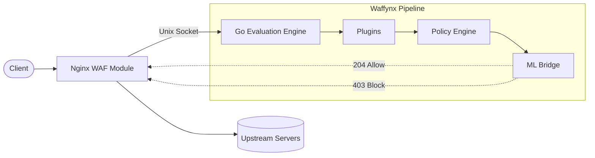

<div align="center">
  <h1>🛡️ Waffynx</h1>
  <p><b>Next-generation Web Application Firewall</b></p>
  <p>Native Nginx integration • High-performance Go sidecar • ML Anomaly Detection</p>
</div>

<br/>

Waffynx is a modern Web Application Firewall (WAF) designed for zero-latency overhead and advanced threat protection. It seamlessly integrates directly into Nginx via a custom C module and evaluates requests through a high-performance Go sidecar utilizing rule-based policies and Machine Learning anomaly scoring.

---

## 🚀 Key Features

* **Native Nginx Integration**: Intercepts requests at the ACCESS phase with near-zero latency. Uses a heavily optimized, stripped-down Nginx binary (868KB).
* **Multi-Stage Evaluation Pipeline**: Traffic flows through a chain of dynamic plugins, a robust policy engine, and finally an ML anomaly scorer.
* **Deep Body Inspection**: Detects SQLi, XSS, Command Injection, and Path Traversal even within complex POST bodies (JSON, GraphQL, File Uploads).
* **Built-in Protection Plugins**:
  * `request-validation`: Strict schema enforcement.
  * `bot-protection`: Advanced bot mitigation.
  * `rate-limit`: Distributed token bucket (Redis-backed).
  * `geo-block`: MaxMind IP intelligence.
* **C++ Machine Learning Bridge**: Swappable ML engine (integrates with open-appsec) for behavioral entropy analysis and pattern detection.
* **Enterprise Management**: REST API with JWT authentication, a single-page Dashboard UI, and Prometheus metrics out of the box.
* **Host Firewall Agent**: Automated IP blocking via nftables/UFW integration.

## 🏗️ Architecture

Waffynx decouples the proxy layer from the security evaluation layer to maximize throughput:



## ⚡ Quick Start

> **Note**: Waffynx requires a Linux environment (Debian/Ubuntu) or WSL.

### 1. Prerequisites
Ensure you have the required build tools and Go installed:
```bash
sudo apt-get update && sudo apt-get install -y build-essential libpcre2-dev libssl-dev zlib1g-dev
```

### 2. Clone & Build
```bash
git clone --recurse-submodules https://github.com/jackby03/waffynx.git
cd waffynx

# Build the custom Nginx proxy
make nginx-checkout
make nginx-configure
make nginx-build

# Build the Go components (CLI, Agent, API, Bridge)
make build
make bridge-build
```

### 3. Run Locally (Development)
You can utilize our Vagrant environment for a complete out-of-the-box sandbox:
```bash
make vagrant-up
make vagrant-ssh

# Inside the VM, Waffynx is automatically provisioned and running:
curl http://localhost:8080/                              # 200 OK (Allowed)
curl "http://localhost:8080/?q=UNION+SELECT+1,2,3"       # 403 Forbidden (Blocked)
```

## 🗺️ Enterprise Roadmap

For the detailed, exhaustive architectural specification of every module, refer to the master [**Enterprise Roadmap Document (docs/ROADMAP.md)**](docs/ROADMAP.md).

### ✅ Production Foundations (P0 - Implemented & Working):
- **Native Nginx Ingress C Module & Sidecar IPC:** Zero-copy Unix Domain Socket (`0600`) inspection pipeline.
- **Core L7 Policy Engine:** Deterministic rule evaluation (SQLi, XSS, Path Traversal, Bot scanners).
- **L3/L4 Kernel Blocking Agent:** Automated `nftables` / `ufw` drop synchronization (`waf-agent`).
- **Distributed Rate Limiting:** High-performance in-memory and Redis-backed sliding window throttler.
- **ML Anomaly Scoring Bridge:** Standalone daemon integration with `open-appsec`.
- **Cyber-Ops SOC Control Room:** React 19 single-page application with mock dev environment and real-time SSE telemetry.
- **Strict Cryptographic Invariants:** Constant-time token comparison, fail-closed enforcement, zero unauthorized dependencies.

### 🚀 Upcoming Feature Pillars:
1. **Traffic Director & Reverse Proxy (Phase 1):** Virtual Servers, Upstream Pools, Passive/Active Health Checks, Custom Error Pages (`404`, `403`, `500`), Server Cloaking and Stack Trace Stripping.
2. **L7 WAF / ASM & Bot Defense (Phase 2):** Positive Security Model (white-lists), OpenAPI/Swagger schema validation, Anti-CSRF tokens, JS cryptographic challenges, CAPTCHA, and Client Fingerprinting (JA3/JA4).
3. **Network & Transport Filtering - L3/L4 AFM (Phase 3):** Stateful packet inspection (SPI), hardware SYN Cookies, volumetric flood mitigation (UDP/ICMP/Smurf), and Route Domains.
4. **SSL / TLS Cryptography & Orchestration (Phase 4):** SSL Offload / Bridging / Passthrough, mTLS with client certificates, CRL/OCSP stapling, and SNI dynamic routing.
5. **Threat Intelligence & Reputation (Phase 5):** Automated Tor Exit Node & Anonymous Proxy blocking, GeoIP/ASN filtering (MaxMind), and dynamic IOC feed synchronization.
6. **DNS Protocol Security - GTM / DNS Firewall (Phase 6):** Response Rate Limiting (RRL), DNS Cache Poisoning (Kaminsky) mitigation, DNSSEC validation, and DNS tunneling exfiltration detection.
7. **Access & Identity Management - APM (Phase 7):** Pre-authentication perimeter proxy, SAML 2.0 & OIDC IdP/SP federation, and contextual dynamic RBAC.
8. **Real-Time Rules Engine - iRules / WafRules (Phase 8):** Dynamic scripting engine for L4/L7 connection events, on-the-fly header rewrite, and payload modification.
9. **High-Speed Logging & Distributed Telemetry (Phase 9):** High-speed asynchronous Syslog/HSL to SIEMs (Splunk, Elastic, Sentinel) and distributed session state sharing.

## 📖 Documentation

* **[AGENTS.md](AGENTS.md)**: Detailed architecture specs, development gotchas, and internal component mapping.
* **Configuration**: Check out `configs/waffynx.yaml` for a full production configuration template.

## 📄 License

This project is licensed under the MIT License.
